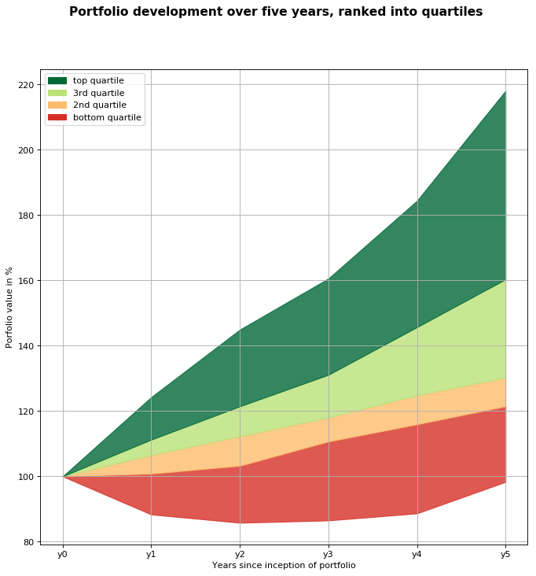

# What percentag of a portfolio should go to stocks vs bonds?
- depends on how you value risks vs expected returns
- Need to know the probability distribution of portfolio returns to choose this

# The lack of data for index-ETF portfolio returns
- Offered by many fintechs
- Usually only data on last few years, no recession included

# Approximating index-ETF portfolio returns by looking at historical data
- no data on index-ETFs, but can approximate them by looking at S&P500 and treasuries

# On average, stocks have done better than treasuries

# Bonds have done better during recessions

# ETF-Index portfolios' return profiles for different equity shares
- 30% stocks
- 60% stocks
- 90% stocks
